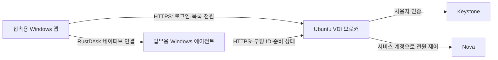

# 관리형 데스크톱과 사용자 배정

0.2부터 일반 사용자는 네이티브 앱에서 VDI 브로커에 로그인합니다. 브로커가
Keystone의 사용자 UUID를 확인하고 해당 사용자에게 배정된 VM만 반환합니다.
전원과 접속 요청에서도 같은 배정을 다시 검사합니다. 화면 전송은 RustDesk가 담당합니다.



## 배정 설정

브로커 설정은 서버의 `/etc/openstack-vdi/broker.json`에 둡니다.
서비스 사용자가 읽을 수 있고 일반 사용자는 수정할 수 없도록 보호합니다.
`assignments`의 키는 로그인 이름이 아닌 **Keystone 사용자 UUID**입니다.

```json
{
  "identity_url": "https://identity.example:5000/v3",
  "ca_file": "/etc/openstack-vdi/openstack-ca.pem",
  "service": {
    "profile": {
      "auth_url": "https://identity.example:5000/v3",
      "username": "vdi-broker-service",
      "project_name": "vdi-desktops",
      "ca_file": "/etc/openstack-vdi/openstack-ca.pem"
    },
    "password": "REPLACE_WITH_SERVICE_SECRET"
  },
  "assignments": {
    "KEYSTONE_USER_UUID_A": ["WORK_VM_UUID_A"],
    "KEYSTONE_USER_UUID_B": []
  },
  "desktops": {
    "WORK_VM_UUID_A": {
      "name": "업무용 PC",
      "peer_id": "123456789",
      "agent_token": "REPLACE_WITH_UNIQUE_RANDOM_AGENT_SECRET"
    }
  }
}
```

배정 수정은 파일을 원자적으로 교체하면 다음 API 요청부터 적용됩니다.
빈 배열은 배정 대기 사용자, 사용자 키 삭제는 브로커 사용 권한 회수입니다.
서비스 계정은 VM이 있는 프로젝트의 필요한 역할만 부여합니다.
일반 사용자에게 이 프로젝트의 Nova 역할을 주지 않아야 브로커를 우회한 전원 조작도 막힙니다.
프로젝트 이름이나 VM 이름을 보안 경계로 사용하지 않습니다.

테스트 환경에서는 `vdi-prototype`의 기존 `admin` 프로젝트 역할을 제거했습니다.
별도 `vdi-broker-service`가 전원을 제어하며 사용자에게는 업무용 PC 한 대만 배정했습니다.
배정이 없는 `vdi-other`는 빈 목록을 받으며 업무용 PC 전원·접속 API는 403으로 거부됩니다.

RustDesk 인증은 별도입니다. 브로커에서 배정을 회수해도 이미 열린 RustDesk 세션이나
사용자가 알고 있는 원격 암호 자체를 폐기하지는 않습니다. 완전한 접근 회수에는
RustDesk 세션 종료·원격 암호 교체도 필요합니다. Windows 로그인과 망 분리도 별도입니다.

## 준비 상태와 재접속

업무용 Windows에 `setup-desktop-agent.ps1`로 에이전트를 설치합니다.
관리자 경로로 전송한 enrollment에는 `broker_url`, `vm_id`, VM마다 다른 `token`,
RustDesk의 `id_server`를 지정합니다. 브로커 CA 인증서도 함께 전달합니다.

에이전트는 SYSTEM 시작 작업으로 실행됩니다. RustDesk 자동 시작과 서비스 실패 시
재시작을 설정하고, Windows 부팅 ID·서비스 상태·ID 서버 TCP 연결 여부를 5초마다 전송합니다.
3회 연속 정상 확인 후 준비 상태를 보고합니다. 25초 이상 신호가 없으면 준비 상태가 해제됩니다.
TLS 검증을 끄지 않습니다. agent.json은 SYSTEM/Administrators만 읽을 수 있습니다.

- 꺼진 PC에서 **켜고 접속**: 전원 요청 → Windows 준비 대기 → 원격 창 열기.
- **재부팅 후 접속**: 이전 부팅 ID와 다른 신호를 받은 뒤 원격 창을 다시 엽니다.
- 접속 대기는 최대 5분이며 **접속 취소**는 이후 자동 연결만 취소합니다. 전원 요청은 되돌리지 않습니다.
- 일시적인 연결 끊김은 기존 준비 신호의 유효시간이 지난 35초 뒤부터 한 번 재시도하며, 실패하면 사용자가 다시 접속할 수 있습니다.
- Windows 앱은 RustDesk 1.4.9의 화면 처리·연결 종료 로그와 실제 창을 관찰합니다.
  프로세스 실행만으로 ‘연결됨’을 표시하지 않습니다. 관찰하지 못한 상태는 접속 창 열림으로 표시합니다.
- 앱은 한 번에 하나의 원격 연결을 관리합니다. 다른 PC를 선택하면 기존 창을 닫을지 확인합니다.
  동일 PC를 누르면 기존 창으로 이동합니다. Linux는 원격 창 상태 관찰을 지원하지 않습니다.

준비 신호는 서비스 준비의 증거입니다. Windows 로그인 성공이나 화면 수신까지 보장하지는
않으며, 실제 연결 상태는 접속 단말에서 별도로 확인합니다. RustDesk 버전 변경 시 로그
관찰기를 재검증해야 합니다.

로그 이벤트 기준 소스: [RustDesk 1.4.9 client.rs](https://github.com/rustdesk/rustdesk/blob/6c578292e8ebbbec708b76986ba8c4bc7c509747/src/client.rs),
[io_loop.rs](https://github.com/rustdesk/rustdesk/blob/6c578292e8ebbbec708b76986ba8c4bc7c509747/src/client/io_loop.rs).

## 설치와 업데이트

GitHub Actions의 `OpenStackVDI-Installer` 아티팩트에 Windows 설치 EXE와 SHA-256이 있습니다.
첫 설치에는 관리자가 제공한 enrollment JSON과 CA 파일을 선택합니다.
설치 프로그램이 앱·바탕화면 바로가기·회사 연결 설정을 준비합니다. RustDesk가 없으면
공식 1.4.9 설치 파일을 내려받고 고정 SHA-256을 검증해 설치합니다.
오프라인 설치는 `/RUSTDESKINSTALLER="C:\Setup\rustdesk.exe"`로 사전 전달 파일을 지정합니다.
기존 RustDesk를 설치한 단말은 같은 버전을 사용하는지 관리자가 확인해야 합니다.

```json
{
  "profile": {
    "broker_url": "https://vdi.example:8443",
    "username": "",
    "auth_url": "",
    "project_name": "",
    "ca_file": "broker-ca.pem"
  },
  "rustdesk": {
    "id_server": "vdi.example:21116",
    "relay_server": "vdi.example:21117",
    "key": "SERVER_PUBLIC_KEY"
  }
}
```

암호는 enrollment에 포함하지 않습니다. 설치된 연결 설정과 CA는 Program Files에 두고,
사용자는 계정·비밀번호만 입력합니다. 선택한 앱 로그인 정보는 **Windows 자격 증명 관리자**에
저장하며 JSON·명령줄에 저장하지 않습니다. 앱 로그아웃 시 저장한 앱 암호를 삭제합니다.
RustDesk의 ‘비밀번호 기억’은 해당 프로그램이 관리합니다. Windows 잠금 해제는 별도입니다.

업데이트를 제공하려면 브로커 설정에 다음 항목을 추가합니다.

```json
{
  "client_installer": "/opt/openstack-vdi/releases/OpenStackVDI-Setup-0.2.2.exe",
  "client_release": {
    "version": "0.2.2",
    "url": "https://vdi.example:8443/download/client",
    "sha256": "REPLACE_WITH_INSTALLER_SHA256"
  }
}
```

**앱 정보 / 업데이트**에서 확인하고 설치할 수 있습니다. 앱은 동일한 브로커 HTTPS
주소에서만 설치 파일을 받으며 리디렉션을 따르지 않고 SHA-256을 검증합니다.
설치 전에 사용자의 확인과 Windows 관리자 권한이 필요합니다. 기존 연결 설정을 유지합니다.
서명 인증서는 아직 적용하지 않았으며 Windows가 게시자를 확인하지 못했다는 안내를 할 수 있습니다.

## 서버 운영 범위

`infra/broker/requirements.txt`와 systemd 유닛으로 기존 Ubuntu VM에 설치합니다.
`enable_broker = true`로 허용된 클라이언트 CIDR에만 HTTPS 8443을 엽니다.
브로커는 비관리자 OS 서비스 사용자로 실행하고 TLS 인증서·키를 별도 배포합니다.
프로토타입은 **단일 프로세스**이며 토큰·준비 상태·진행 중 전원 작업은 메모리에 있습니다.
서버 재시작 후 사용자는 다시 로그인합니다. 고가용성·영속 세션·중앙 SSO는 포함하지 않습니다.
